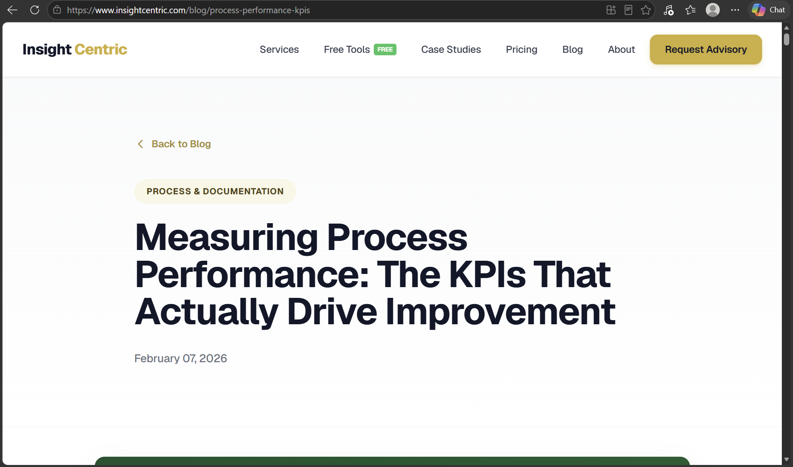
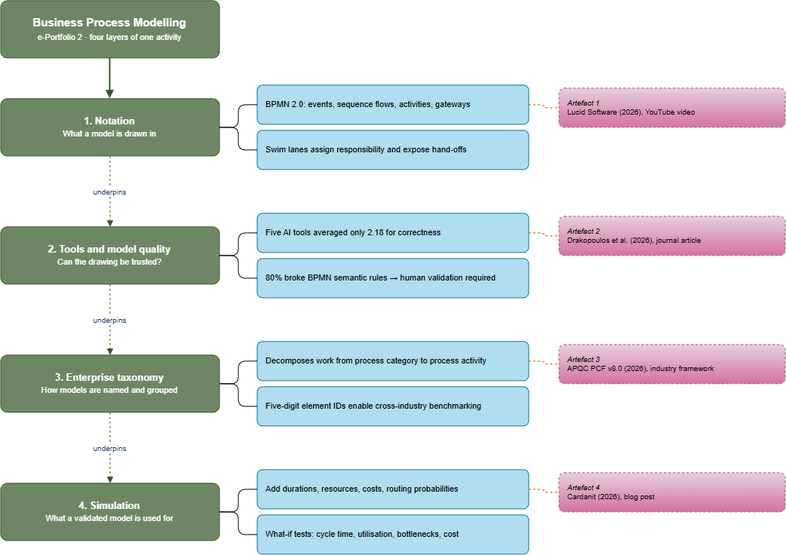

# COIT20252 – e-Portfolio 2: Business Process Modelling

## 1. BPMN 2.0 and Swim Lane Diagrams

**Artefact 1: YouTube Video** — [BPMN diagram tutorial](https://www.youtube.com/watch?v=6Juh83sxKkQ) (Lucid Software)

This Youtube video by Lucid Software gives us a tutorial to buuild BPMN 2.0 model from an empty canvas. In this video, they compare BPMN with flowcharts and then add the notations in order of: start, intermediate and end events, sequence flows, activities and tasks, gateways for the decision paths, and lastly pools and swim lanes depicting owns each activity and where hand-offs sit (Lucid Software, 2026, 00:07:04).

I chose this artefact because it shows the modelling decisions from Week 4 slides. It explains how flowchart only records sequence, the BMPN diagram records responsibilities and the events that trigger and end a process.

## 2. How Reliable Are AI Modelling Tools?

**Artefact 2: Journal Article** — Drakopoulos et al. (2026), *Computation*, DOI: [10.3390/computation14010010](https://doi.org/10.3390/computation14010010)

This is a peer-reviewed article from 2026. It tests whether five AI tools can produce a valid BPMN model from a written process description, by taking driver's license renewal as a case. Each of these models were scored for clarity, correctness and completeness (Drakopoulos et al., 2026, p. 5). Among these, Camunda BPMN Copilot scored the highest, but on average, the correctness among all tools was only 2.18, while 80% of the models broke the BPMN semantic rules (Drakopoulos et al., 2026, p. 12).

This was chosen to test the tool layers from Artefact 1. The tools were able to reproduce the symbols but not the meaning, separating a model that looks right from the one that is actually right. It explains the reason for CBOK treating defined notation standard and regular consistency checking as governance (ABPMP International, 2019, p. 94).

## 3. Frameworks for Grouping Processes

**Artefact 3: Industry Framework** — [APQC Process Classification Framework (PCF), Cross-Industry, Version 8.0](https://www.apqc.org/resource-library/resource-listing/apqc-process-classification-framework-pcf-cross-industry-pdf-13) (APQC)

The third artefact is a cross-industry taxonomy that decomposes work from high-level process categories down to individual process activities. This results in an organization having an inventory of the work it does. All elements carry a five digit ID, which allows the organization to benchmark one another and track themselves over time, even when they use different names for the same process (APQC, 2026, 'Description' section).

The reason to choose this artefact is because it is operating on a different level than 2 previous artefacts. While BPMN standardises how a single process in drawn, the PCF standardises how the whole set of process is named and grouped.

## 4. From a Static Model to a Simulation

**Artefact 4: Blog Post** — [Best business process simulation software in 2026](https://www.cardanit.com/blog/best-business-process-simulation-software/) (Cardanit)

This 2026 June blogpost is the final artefact in this ePortfolio. This explains how simulation extends a BPMN model as compared to replacing it. Task durations, resource availability, activity costs, routing probabilities and working calendars are layered onto the existing diagram, which turns it into a decision-support tool, allowing teams to test what-if scenarios (Cardanit, 2026, 'How business process simulation works' section).

I chose this model because it lies between the static and dynamic gap of Week 4 and Week 5 lecture slides. A static model shows a single state, while parameters let the same diagram show behaviour over time. This artefact also shows why modelling comes before simulation because simulation output can only be as trustworthy as the model under it.

## Mind Map: 

I drew this mindmap in draw.io to see how the four artefacts described above relate to each other. They are set across as four layers of one activity: 

notation Artefact 1 is what a model is drawn in,

tooling and quality control Artefact 2 decide whether the drawing can be trusted, 

the enterprise taxonomy Artefact 3 decides how models are named and grouped, and 

simulation Artefact 4 is what a validated model is used for.

## Applying This to a Process I Use

To test whether I could use the notation, I modelled CQUniversity's assignment extension request as a swim lane diagram. It has four participants, so four lanes: student, unit coordinator, student support and the Moodle submission system. 

The trigger is the student lodging the request, the end event is the decision recorded against the assessment item, and one gateway covers approve, decline or request further documentation. Modelling it exposed two hand-offs where the request waits on someone else, which are exactly the points a simulation would need duration data for.

## Use of AI

I used a generative AI tool during planning and research only. I used it to shortlist possible topics from the Week 4 to 6 lecture slides and to run initial searches for sources published in 2025 or later. I then read and checked every artefact myself, confirmed the publication dates and citations, and wrote the summaries, reflections and mind map in my own words.

## Reference

ABPMP International 2019, *BPM CBOK version 4.0: guide to the business process management common body of knowledge*, Association of Business Process Management Professionals, Lexington.

APQC 2026, *APQC process classification framework (PCF) – cross-industry – PDF version 8.0*, viewed 1 September 2026, https://www.apqc.org/resource-library/resource-listing/apqc-process-classification-framework-pcf-cross-industry-pdf-13

Cardanit 2026, *Best business process simulation software in 2026*, viewed 28 August 2026, https://www.cardanit.com/blog/best-business-process-simulation-software/

CQUniversity 2026, 'Business process modelling (part 2)', *COIT20252 Business Process Management*, lecture slides, Week 5, CQUniversity Australia.

Drakopoulos, P, Malousoudis, P, Nousias, N, Tsakalidis, G & Vergidis, K 2026, 'Do LLMs speak BPMN? An evaluation of their process modeling capabilities based on quality measures', *Computation*, vol. 14, no. 1, article 10, DOI: [10.3390/computation14010010](https://doi.org/10.3390/computation14010010)

Lucid Software 2026, *BPMN diagram tutorial*, online video, YouTube, viewed 30 August 2026, https://www.youtube.com/watch?v=6Juh83sxKkQ

