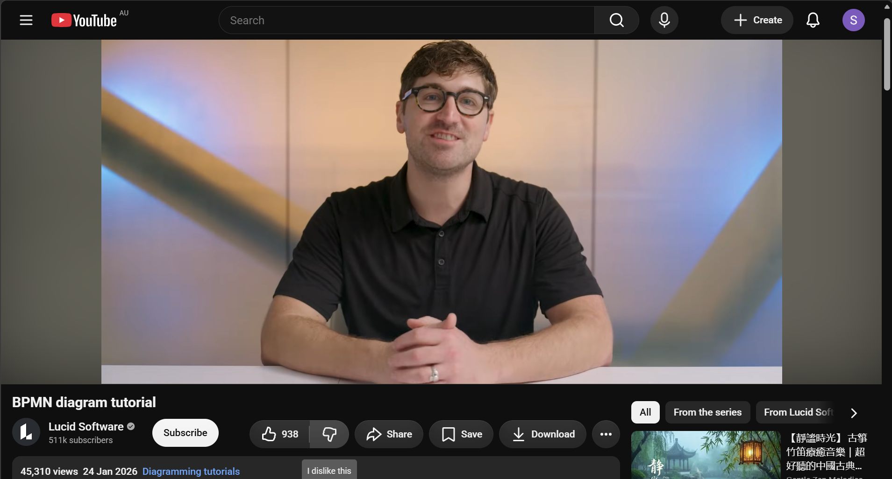
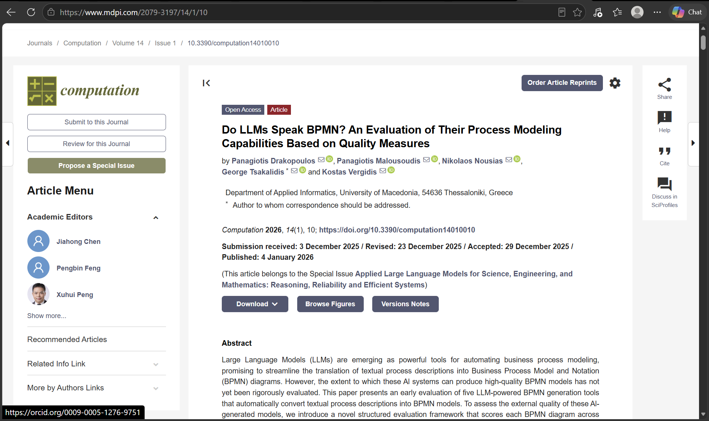
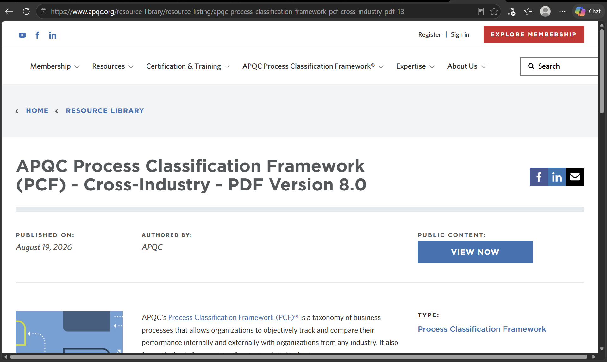

# COIT20252 – e-Portfolio 2: Business Process Modelling

## 1. BPMN 2.0 and Swim Lane Diagrams

**Artefact 1: YouTube Video** — [BPMN diagram tutorial](https://www.youtube.com/watch?v=6Juh83sxKkQ) (Lucid Software)

This Youtube video by Lucid Software gives us a tutorial to buuild BPMN 2.0 model from an empty canvas. In this video, they compare BPMN with flowcharts and then add the notations in order of: start, intermediate and end events, sequence flows, activities and tasks, gateways for the decision paths, and lastly pools and swim lanes depicting owns each activity and where hand-offs sit (Lucid Software, 2026, 00:07:04).

I chose this artefact because it shows the modelling decisions from Week 4 slides. It explains how flowchart only records sequence, the BMPN diagram records responsibilities and the events that trigger and end a process (ABPMP International, 2019, p. 98). 

## 2. How Reliable Are AI Modelling Tools?

**Artefact 2: Journal Article** — Drakopoulos et al. (2026), *Computation*, DOI: [10.3390/computation14010010](https://doi.org/10.3390/computation14010010)

This is a peer-reviewed article from 2026. It tests whether five AI tools can produce a valid BPMN model from a written process description, by taking driver's license renewal as a case. Each of these models were scored for clarity, correctness and completeness (Drakopoulos et al., 2026, p. 5). Among these, Camunda BPMN Copilot scored the highest, but on average, the correctness among all tools was only 2.18, while 80% of the models broke the BPMN semantic rules (Drakopoulos et al., 2026, p. 12).

This was chosen to test the tool layers from Artefact 1. The tools were able to reproduce the symbols but not the meaning, separating a model that looks right from the one that is actually right. It explains the reason for CBOK treating defined notation standard and regular consistency checking as governance (ABPMP International, 2019, p. 94).

## 3. Frameworks for Grouping Processes

**Artefact 3: Industry Framework** — [APQC Process Classification Framework (PCF), Cross-Industry, Version 8.0](https://www.apqc.org/resource-library/resource-listing/apqc-process-classification-framework-pcf-cross-industry-pdf-13) (APQC)

