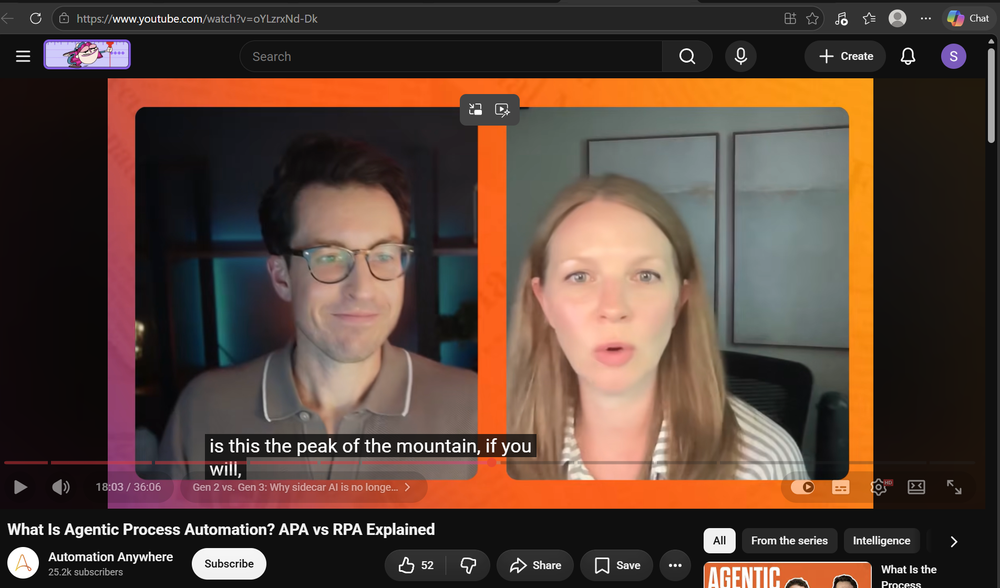
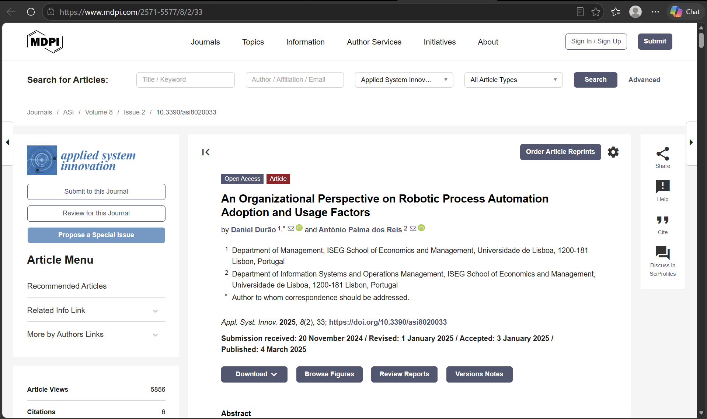
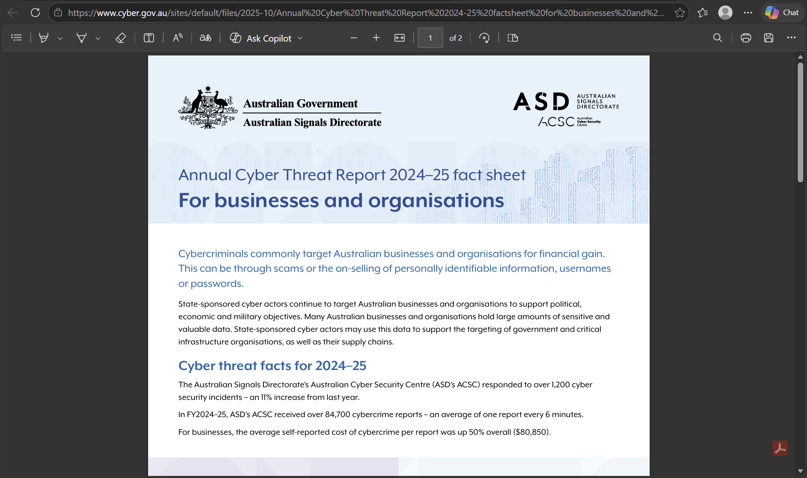
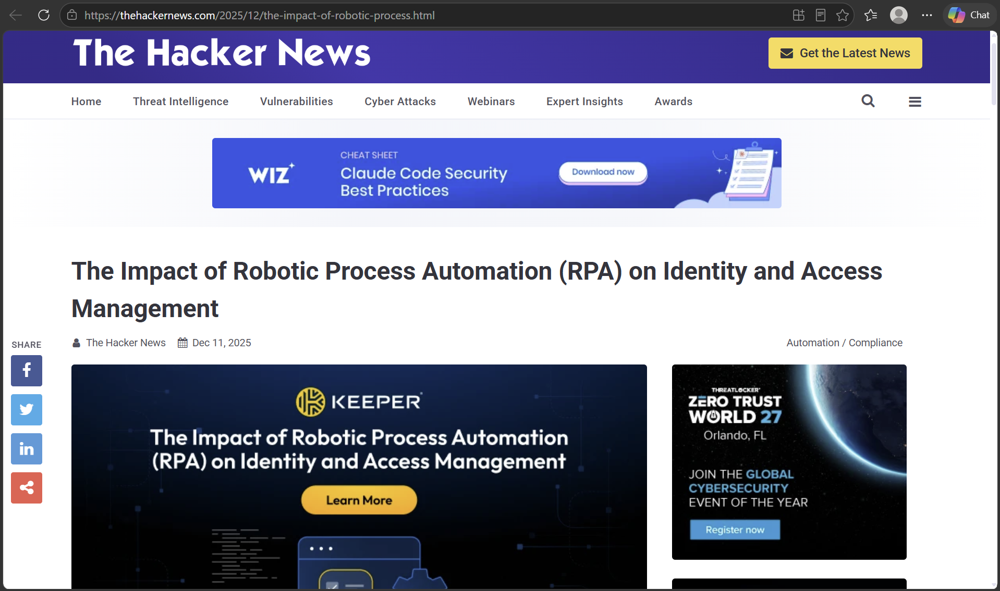
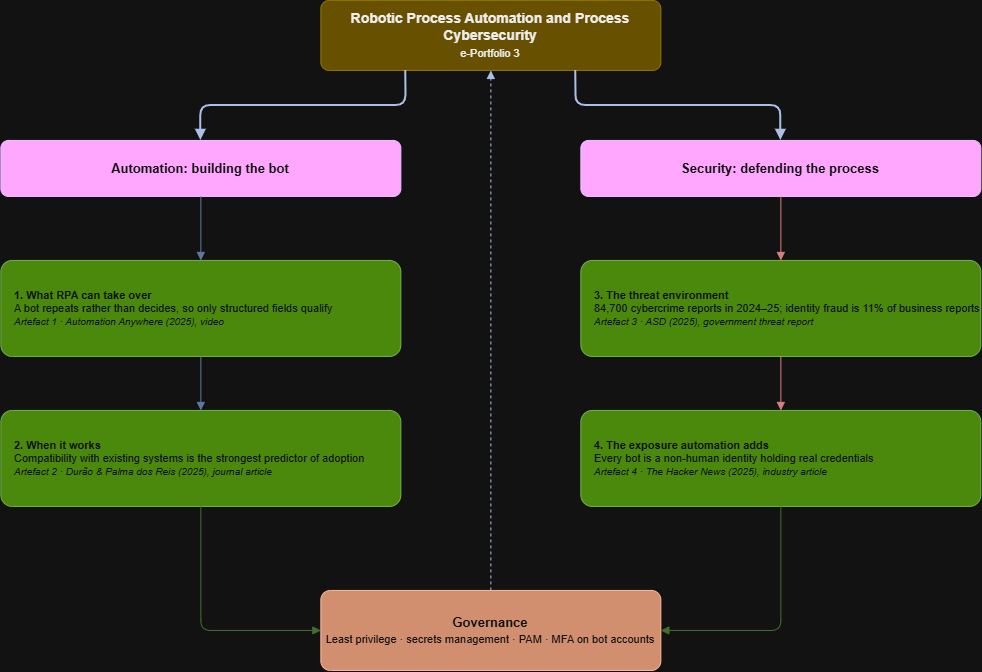

# COIT20252 – e-Portfolio 3: Robotic Process Automation and Process Cybersecurity

## 1. What RPA Can and Cannot Take Over

**Artefact 1: YouTube Video** — [What Is Agentic Process Automation? APA vs RPA Explained](https://www.youtube.com/watch?v=oYLzrxNd-Dk) (Automation Anywhere)

The first artefact is a Youtube podcast style video discussing agentic process automation and its comparison with earlier automation models, which could only copy what a person had already done in the system (Automation Anywhere, 2025, 00:12:39). The hosts cite an IBM survey of 2000 Business Executives finding that only 25% of AI initiatives returned on their expectation (Automation Anywhere, 2025, 00:01:58).

I tested this with CQU Assignment extension process via Moodle, which asks for the extension date, reason for extension, and supporting documents. Week 8 defines RPA as automating repetitive, rule-based office work (CQUniversity 2026, Week 8, slides 17), based on the video, a bot does repetition rather than decision. Since on Moodle, student details and unit details are repetition so a bot can handle that but the reason for extension, and the attachment are not. Earlier I had thought that the whole process could be automated.

## 2. What Makes RPA Adoption Work

**Artefact 2: Journal Article** — Durão and Palma dos Reis (2025), *Applied System Innovation*, DOI: [10.3390/asi8020033](https://doi.org/10.3390/asi8020033)

This 2025 study surveyed 141 organizations in Portugal and considered the factors driving RPA adoption (Durão & Palma dos Reis, 2025, p. 8). It was found that the compatibility with existing systems and procedures are among the top factors while complexity, technology competence and pressure were not significant (Durão & Palma dos Reis, 2025, p. 10).

Week 8 lecture slides has process selection criteria as the things to look for in the task (ABPMP International, 2019, p. 256). Since compatibility was the strongest factor, it could be linked to the extension form. It already is inside the Moodle, so for a RPA bot it doesnt need to move across systems. But since attachment and text box inside the form have no structure, there is nothing for the bot to match against. Also, since this study is for a single country Portugal, so I'm not sure how this would hold up against extension form in Moodle.

## 3. The Threat Around the Process

**Artefact 3: Government Threat Report** — [Annual Cyber Threat Report 2024–25 fact sheet for businesses and organisations](https://www.cyber.gov.au/sites/default/files/2025-10/Annual%20Cyber%20Threat%20Report%202024-25%20factsheet%20for%20businesses%20and%20organisations.pdf) (ASD's Australian Cyber Security Centre)

ASD received a total of over 84700 cybercrime reports in 2024-25 alone, and the average self-reported cost to business to rise by 50% to $80,850. Among the reported businesses, the most reported ones were email compromise at 19%, business email compromise fraud at 15% and identity fraud at 11% (ASD, 2025, p. 1).

Week 8 defines process cybersecurity as protecting availability, integrity and confidentiality (CQUniversity 2026, Week 8, slide 24). Identity fraud is the third most reported business cybercrime, and extension form is submitted from a student account. So the integrity of the student request lies within the account. In this case, confidentiality also matters because the submitted forms may contain medical information or personal issues. I don't think letting a bot access these would be a good choice, it needs a human intervention from Unit Coordinator to verify.

## 4. Securing the Bot

**Artefact 4: Industry Security Article** — [The Impact of Robotic Process Automation (RPA) on Identity and Access Management](https://thehackernews.com/2025/12/the-impact-of-robotic-process.html) (The Hacker News)

This article from 2025, treats RPA as non-human identities. It lists risks  such as passwords hardcoded into bot scripts, accounts having more access than needed and bots without owner. This article recommends a secret manager, privileged access management, least privilege and MFA (The Hacker News, 2025, 'Implement PAM' section).

On CQU Week 8 lecture slides, there is written security input as a reason for failure of RPA deployment (CQUniversity 2026, Week 8, slide 22) and lists access controls separately as a cybersecurity measure (CQUniversity 2026, Week 8, slide 28). Implementing RPA on the process will mean that the bot has to login into the system to verify if student is enrolled in the unit or not. Earlier, someone manually would do that and there would be a trace of it, but creating a bot for the automation would mean that the bot account would itself need to be governed. 

## Applying It: The Moodle Extension Form

| Step | Rule-based? | RPA candidate | Control it would need |
|---|:---:|:---:|---|
| Student submits the Moodle form | Trigger only | No | Control with the student|
| Acknowledge the submission | Yes | Yes | Low risk, needs no record access |
| Check enrolment and the assessment due date | Yes | Yes | Read-only bot account, least privilege |
| Read the reason and supporting documents | No | No | Control with the Unit coordinator |
| Apply the new due date in Moodle | Yes | Yes | Write access, logged, MFA on the bot account |

## Mind Map: How the Four Artefacts Fit Together

I built this mind map in Draw.io to work out how the two halves of this topic meet. The left branch runs from what RPA is (Artefact 1) to the conditions that make it work (Artefact 2). The right branch runs from the threat environment an automated process sits in (Artefact 3) to the exposure the automation itself creates (Artefact 4). Both halves meet at Governancce.

## Use of AI

I used a generative AI tool during planning and research only. I used it to shortlist possible topics from the Week 7 to 10 lecture slides and to run initial searches for sources published in 2025 or later. 
I then read and checked every artefact myself, confirmed the publication dates, figures and citations, and wrote the content of this ePortfolio, reflections, table and mind map in my own words.

## Reference

ABPMP International 2019, *BPM CBOK version 4.0: guide to the business process management common body of knowledge*, Association of Business Process Management Professionals, Lexington.

ASD 2025, *Annual cyber threat report 2024–25 fact sheet for businesses and organisations*, Australian Signals Directorate, viewed 22 September 2026, https://www.cyber.gov.au/sites/default/files/2025-10/Annual%20Cyber%20Threat%20Report%202024-25%20factsheet%20for%20businesses%20and%20organisations.pdf

Automation Anywhere 2025, *What is agentic process automation? APA vs RPA explained*, online video, YouTube, viewed 20 September 2026, https://www.youtube.com/watch?v=oYLzrxNd-Dk

CQUniversity 2026, 'Process technologies, robotic process automation and process cybersecurity', *COIT20252 Business Process Management*, lecture slides, Week 8, CQUniversity Australia.

Durão, D & Palma dos Reis, A 2025, 'An organizational perspective on robotic process automation adoption and usage factors', *Applied System Innovation*, vol. 8, no. 2, article 33, DOI: [10.3390/asi8020033](https://doi.org/10.3390/asi8020033)

